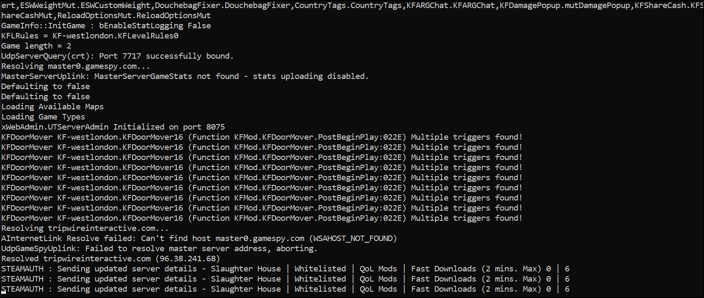

    

- [KF-PORTABLE](#kf-portable)
  - [What is included](#what-is-included)
    - [Vanilla Changes](#vanilla-changes)
    - [Mutator Changes](#mutator-changes)
  - [Usage](#usage)
    - [Server Success Validation](#server-success-validation)
  - [FAQ](#faq)

# KF-PORTABLE

A pre-configured, 2 modes (Whitelisted/Not Whitelisted) *dedicated-server* **configuration** directory for Killing Floor 1

This guide assumes that you are already familiar with setting up a dedicated server via '**steamCMD**', if not, then you can simply contact me using the following:

- [Steam](https://steamcommunity.com/id/Vel-San/)
- Discord: **.Vel-San.#7468**
- [Twitter](https://twitter.com/Vel__San)
- [Other Guides](https://steamcommunity.com/id/Vel-San/myworkshopfiles/?section=guides&appid=1250)

## What is included

This directory is tailored according to my own taste of mutators, which has 2 Modes, **Whitelisted** and **Not-Whitelisted**, that should be run as a *dedicated* server.

### Vanilla Changes

- Server Name (Can be changed to what you want)
- VAC Secured
- Edited parameters to allow downloading of Muts as compressed
- Changed the NAT value
- Changed default launch options of the server (Can be Changed to what you want)
- Added SkillzServer as a redirectURL

### Mutator Changes

I currently have 2 lists of mutators in my Steam Collections:

- Not-Whitelisted, Minimal must-have muts that will improve player experience (Affects gameplay in several ways)
  - [Found Here](https://steamcommunity.com/sharedfiles/filedetails/?id=1913521033)
- Whitelisted, Minimal must-have muts that do not affect your gameplay, rather just imrpove Quality of the game
  - [Found Here](https://steamcommunity.com/sharedfiles/filedetails/?id=1490172785)

Below, you can see the currently installed (**And configured**) mods if you are using this repo:

>**ZedKillCount** | Shows a detailed view of ZEDs killed after a wave is done
>
>**WeaponPickupMessage** | Shows a message on weapon pickup, visible to all players
>
>**RgMsgMut** | Shows a message when someone rages a Scrake or a Fleshpound
>
>**PatriarchScoreboard** | Shows detailed view of Daddy Patty stats once you kill him, or he kills you
>
>**MedicAlert** | Shows a message to the medic **ONLY** if someone needs healing
>
>**ESWWeightMut** | Customize the inventory weight so you can buy more weapons
>
>**DouchebagFixer** | Shows a message that someone is not grouped up, and kicks them if they don't gather
>
>**CountryTags** | Shows country TAG next to names in ScoreBoard
>
>**KFARGChat** | Shows a small Chat-icon if someone is typing something
>
>**KFDamagePopup** | Shows damage popups when you hit a ZED
>
>**KFMutKillMessage** | Shows damage delt on your lower left
>
>**ServerColor** | Change the color of your server name
>
>**KFShareCash** | Shares the cash of disconnected or players who crashed
>
>**CleanAppIDmut** | DLC Unlocker; you can have all weapons!
>
>**Halloween2011Mut** | Changes all Zeds to the [Halloween 2011 ZEDs](http://kf-wiki.com/wiki/Halloween_Sideshow)
>
> **ServerPerks** | A Mut that adds several optimisations to the gameplay, also, makes every Max Rank (6)
>
> **KFMaxPlayers** | Makes the server max players from 6 to 12 (configured to 12)
>
>**ReloadOptionsMut** | Enables you to interrupt a reload, very useful in emergency

All of these mutators are pre-configured for the optimal experience. If you want to manually change the values and configuration of them, you can find the original files here:
<!-- TODO -->
- [MEGA - Default Mutators](https://mega.nz/folder/YDoEmKiC#s6FGAtgh40-TvB4bHsLaMQ)
  - If you want to upload these files to your own FTP host, you have to use **Compresser.bat** to conver them into .uz2 format - you can find the bat also in **\System**

## Usage

Alright. So, assuming you already downloaded the Repo and you have Killing Floor installed via **steamCMD** as a dedicated server.

- Navigate to your local KF-Dedicated Server directory
- Move **\Animations** , **\System** , **\Staticmeshes** and **\Textures** into your local KF server
- Replace all files when prompted

Now we need to update the '*Vanilla*' Settings to what **YOU** want

- Open **Killingfloor.ini** with a file editor (Preferably *VSCode* or *NotePad++*)
- Press Cntrl+F (To Find a keyword)
- Search for '**Change_me**' (Without the quotes)
  - Whenever you find a Change_me keyword, replace it when what you want :)
- Now Copy your server name and open **ServerColor.exe** (Can be found in ServerColor folder)
- Paste your server name, and change the color as you want
  - To do so, pick a color then press *Select* before the word you want to color (Do that for all words you wish to change colors for)
- Once you are done, copy the whole text of server name and click on '**Global**', paste, then test it out
- If you have your server name colored, click on '**Save**', this will generate a **ServerColor.ini** file, copy it and replace the same file in your **\System** (If it has a MapColor=, *delete it*)
- Now look for **KF_Server_Launcher.bat** in **\System**
  - Right click and create a desktop shortcut for it

You are done! Launch Killing Floor from steam, once it loads, go to Open the newly created KF_Server_Launcher shortcut from your desktop. You should be able to view the server once it starts inside the game (Multiplayer > Lan)

NOTE: The default config is the Modded, Not whitelisted mode. If you want to switch your config to Vanilla KF with no Mods at all, press ESC in-game and change the Game Mode in the Map Vote settings. You can find several pre-configured modes that i've made for you

You can join your own server, and if you have all ports properly forwarded in your router, anyone can join you!

### Server Success Validation

When you launch the shortcut, you should see something like the following:

## FAQ

- What are the ports that need forwarding?

>7707 UDP/IP (Game Port)
>
>7708 UDP/IP (Query Port)
>
>7717 UDP/IP (GameSpy Query Port)
>
>28852 TCP/IP and UDP (Allows your Server to Connect to the Master Server Browser)
>
>8075 TCP/IP (Port set via ListenPort that your WebAdmin will run on)
>
>20560 UDP/IP (Steam Port)

- How do I access WebAdmin UI?
  - In your browser, launch
    ><http://127.0.0.1:8075/ServerAdmin/>

    And enter your credentials

- How do I edit the mutator configuration?
  - Hmm.. I haven't added this part to the documentation yet, but if i see demand i'll add it for sure

- Will you add more mutators?
  - If the mut feels like it imrpoves the game quality and doesn't affect the gameplay then yes; Ping me on Steam with your request!

- How can I remove all these mutators and play just vanilla?
  - That is already included in the config. When you launch a game and join it, just press ESC, then Vote for a Map and change the game mode to 'Pure Vanilla'

- How do I install KF in steamCMD as a dedicated server?
  - [Check this out](https://wiki.tripwireinteractive.com/index.php/Dedicated_Server_%28KillingFloor%29)

- Can I run AND play on the server?
  - Yep! Just launch Killing floor from steam first, then launch the Shortcut mentioned in the instructions above
